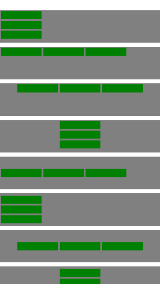

React Native Layout
=================
Shortcuts for React Native View and some styles

Example
================



```js
    <ScrollView style={{marginTop: 20}}>
        <VLayout style={styles.greyContainer}>
          <GreenBox />
          <GreenBox />
          <GreenBox />
        </VLayout>

        <HLayout style={styles.greyContainer}>
          <GreenBox />
          <GreenBox />
          <GreenBox />
        </HLayout>

        <HCenterLayout style={styles.greyContainer}>
          <GreenBox />
          <GreenBox />
          <GreenBox />
        </HCenterLayout>

        <HCenterLayout vertical style={styles.greyContainer}>
          <GreenBox />
          <GreenBox />
          <GreenBox />
        </HCenterLayout>


        <VCenterLayout style={styles.greyContainer}>
          <GreenBox />
          <GreenBox />
          <GreenBox />
        </VCenterLayout>

        <VCenterLayout vertical style={styles.greyContainer}>
          <GreenBox />
          <GreenBox />
          <GreenBox />
        </VCenterLayout>

        <CenterLayout style={styles.greyContainer}>
          <GreenBox />
          <GreenBox />
          <GreenBox />
        </CenterLayout>

        <CenterLayout vertical style={styles.greyContainer}>
          <GreenBox />
          <GreenBox />
          <GreenBox />
        </CenterLayout>
      </ScrollView>    

```